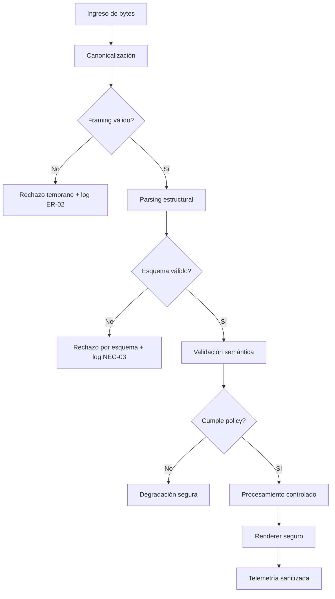

# P01 - Fase A - Tramo B (Día 8 al Día 10)

## Objetivo del tramo

Completar en un solo ciclo las tareas de:

- Día 8: `Diseñar casos negativos iniciales` + `Diseñar criterios de rechazo temprano`.
- Día 9: `Diagramar data flow detallado` + `Priorizar superficies de mayor riesgo`.
- Día 10: `Clasificar failure modes esperables` + `Definir señales de observabilidad`.

Enfoque: `defensive-by-design`, sin PoC explotable, sin datos sensibles y sin pruebas en producción.

---

## Día 8 - Bloque 1: Diseñar casos negativos iniciales

### Catálogo base de casos negativos

| ID | Clase | Entrada inválida | Comportamiento esperado |
|---|---|---|---|
| NEG-01 | Framing | delimitadores truncados | rechazo inmediato con error tipificado |
| NEG-02 | Encoding | secuencias UTF inválidas | normalización fallida + descarte seguro |
| NEG-03 | Tipo | campo crítico con tipo incorrecto | rechazo por esquema |
| NEG-04 | Longitud | campo sobre límite máximo | rechazo temprano sin procesamiento profundo |
| NEG-05 | Anidación | profundidad > máximo | corte por policy con log de límite |
| NEG-06 | Compresión | ratio expansión anómalo | aborto de descompresión por cota |
| NEG-07 | Legacy | campo ambiguo de versión antigua | enrutado a parser legacy aislado o rechazo |
| NEG-08 | Multimedia | descriptor inconsistente | bloqueo en validación de adjuntos |
| NEG-09 | URL preview | metadatos remotos inválidos | degradación segura sin ejecución de fetch riesgoso |
| NEG-10 | Estado | secuencia fuera de orden | reinicio de estado y rechazo |

### Salida del bloque

1. 10 casos negativos definidos y trazables.
2. Criterio esperado por caso (aceptar/rechazar/degradar).
3. Base lista para convertirse en pruebas automatizadas.

---

## Día 8 - Bloque 2: Diseñar criterios de rechazo temprano

### Política de rechazo temprano (Early Reject Policy)

1. `ER-01` rechazar payload antes de Stage-3 si falla canonicalización.
2. `ER-02` rechazar en Stage-2 cualquier framing inconsistente.
3. `ER-03` limitar tamaño total y por campo antes de parseo semántico.
4. `ER-04` bloquear anidación por encima del umbral definido.
5. `ER-05` cortar descompresión al exceder ratio permitido.
6. `ER-06` aplicar `deny-by-default` a campos no reconocidos en rutas críticas.
7. `ER-07` aislar rutas legacy y exigir validación extra.
8. `ER-08` desacoplar renderer de cualquier entrada no validada.

### Métricas de efectividad asociadas

| Métrica | Fórmula | Meta inicial |
|---|---|---|
| `ER-RejectCoverage` | `casos_neg_rechazados_temprano / casos_neg_totales * 100` | `>= 95%` |
| `ER-DeepParseAvoided` | `rechazos_pre_stage3 / rechazos_totales * 100` | `>= 90%` |
| `ER-FalseRejectRate` | `rechazos_invalidos / mensajes_validos * 100` | `<= 1%` |

---

## Día 9 - Bloque 1: Diagramar data flow detallado

### Flujo detallado por etapas y artefactos

### Controles embebidos en el flujo

1. Validación incremental por capas.
2. Separación entre parsing y rendering.
3. Trazabilidad de rechazo con códigos estables.

---

## Día 9 - Bloque 2: Priorizar superficies de mayor riesgo

### Matriz de priorización

| Superficie | Probabilidad | Impacto | Prioridad | Acción inmediata |
|---|---:|---:|---|---|
| Parser de contenedores complejos | Alta | Crítico | P0 | fortalecer límites + tests negativos dedicados |
| Rutas legacy de compatibilidad | Alta | Alto | P0 | aislamiento + validación por versión |
| Pipeline de adjuntos multimedia | Media | Alto | P1 | sandbox + tipado estricto |
| URL preview y metadatos remotos | Media | Alto | P1 | fetch aislado + timeouts + allowlist |
| Renderer de notificaciones | Baja | Alto | P1 | input totalmente validado + encoding seguro |
| Telemetría y logging | Media | Medio | P2 | redacción + minimización de datos |

### Resultado del bloque

1. Superficies priorizadas con criterio cuantificable.
2. Plan de mitigación inicial por prioridad.

---

## Día 10 - Bloque 1: Clasificar failure modes esperables

### Taxonomía de failure modes

| ID | Failure mode | Síntoma | Riesgo |
|---|---|---|---|
| FM-01 | Error de canonicalización | parse fallido temprano | Medio |
| FM-02 | Desbordamiento lógico de longitud | consumo excesivo de memoria | Alto |
| FM-03 | Estado inconsistente del parser | transición inválida | Alto |
| FM-04 | Ambigüedad de tipo en campo crítico | interpretación divergente | Alto |
| FM-05 | Degradación incompleta en policy gate | paso de contenido no confiable | Crítico |
| FM-06 | Falla de aislamiento legacy | bypass de controles modernos | Crítico |
| FM-07 | Exceso de trabajo en preview remoto | latencia y potencial DoS | Alto |
| FM-08 | Registro de datos sensibles en logs | fuga de información | Medio |

### Respuesta defensiva por clase

1. Fail-close para FM-02, FM-03, FM-05 y FM-06.
2. Degradación segura para FM-01 y FM-07.
3. Redacción obligatoria para FM-08.

---

## Día 10 - Bloque 2: Definir señales de observabilidad

### Señales mínimas obligatorias

| Señal | Tipo | Uso |
|---|---|---|
| `obs.reject.stage` | contador | detectar etapa de rechazo dominante |
| `obs.reject.reason_code` | etiqueta | clasificar causa de rechazo |
| `obs.parser.state_reset` | contador | detectar inconsistencias de estado |
| `obs.payload.size_bucket` | histograma | vigilar distribución de tamaños |
| `obs.nesting.depth_bucket` | histograma | vigilar profundidad de estructuras |
| `obs.legacy.route_hit` | contador | monitorear uso de rutas legacy |
| `obs.preview.timeout` | contador | controlar riesgos en preview remoto |
| `obs.sanitization.redaction_applied` | contador | auditar redacción de datos |

### Alertas iniciales

1. Alerta A1: `obs.legacy.route_hit` sube > 30% semana/semana.
2. Alerta A2: `obs.reject.stage=Stage-5` > 20% del total (posible rechazo tardío excesivo).
3. Alerta A3: `obs.preview.timeout` supera umbral baseline + 2 desviaciones.
4. Alerta A4: `obs.sanitization.redaction_applied = 0` en corridas con errores.

---

## Criterio de cierre del Tramo B

1. Casos negativos definidos y priorizados.
2. Criterios de rechazo temprano formalizados con métricas.
3. Data flow detallado documentado.
4. Superficies de riesgo priorizadas con acciones.
5. Failure modes taxonomizados.
6. Señales de observabilidad y alertas mínimas definidas.

## Salida para el siguiente tramo

1. Base lista para Día 11-13 (matriz multi-versión, compatibilidad y entorno).
2. Casos negativos listos para automatizar en pruebas de regresión.
3. Telemetría inicial lista para instrumentación técnica en fases siguientes.
